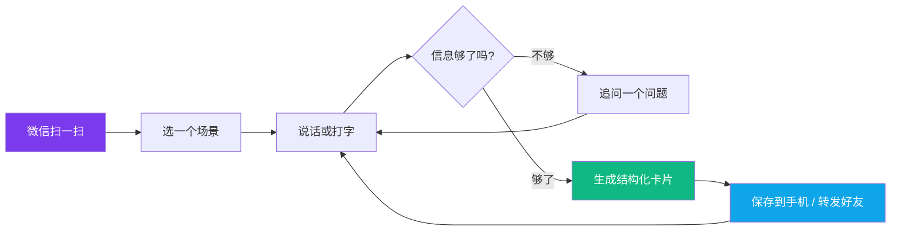

# 省心聊

> 想到啥就说啥，聊清楚，办明白。

---

## 这是什么

一个给**完全不会用 AI 的人**做的 AI 工具。

你妈不需要知道什么是"提示词"。她打开手机，说一句"周末想带孙子出去玩两天"，省心聊会像唠嗑一样，一步一步问清楚：去哪儿、几天、几个人、多少钱。问完了，直接出一张**行程卡片**，长按就能保存到手机，转发到家庭群。

不需要注册，不需要登录，微信扫个码就能用。

## 为什么做这个

我奶奶的妈妈还在的时候，来我们家看到座机，拿起来就说话，叫我奶奶。她没有"拨号"的概念。

现在我妈面对 AI，也是这样。她知道 AI 能帮忙，但你让她"写一段提示词"，她张不开嘴。不是她笨，是这东西就不是给她设计的。

省心聊做的事情很简单：**把"会写提示词"这件事，从用户身上挪到 AI 身上。** 用户只管说人话，AI 负责追问、补全、结构化，最后给一个看得懂、用得上的结果。

## 三个场景

| 场景 | 说了啥 | 出什么 |
|------|--------|--------|
| 🧳 做个行程 | "周末想带孙子去近郊玩两天" | 每日安排 + 行李清单 + 贴心提醒 |
| 🍲 做个菜谱 | "冰箱里有鸡蛋西红柿青椒，能做啥" | 食材表 + 步骤 + 小贴士 |
| 💌 写个信 | "给女儿写几句话让她别总熬夜" | 念出来的版本 + 适合发微信的版本 |

当然，随便聊也行。它联网，知道今天几号，能查最新的信息。

## 怎么用



1. **扫码** — 管理员生成一个二维码，发到家庭群
2. **选场景** — 三个大按钮：做个行程 / 做个菜谱 / 写个信
3. **说话** — 想到啥说啥，说不清楚没关系
4. **追问** — 它一次只问一个问题，不像表单那样吓人
5. **出卡片** — 信息够了，自动生成一张好看的结果卡片
6. **保存 / 转发** — 长按保存图片，或一键转发给微信好友

## 亮点

- **零门槛**：不注册、不登录、不输网址，微信扫码即用
- **会追问**：用户说不清楚？AI 一次只问一个问题，像唠嗑一样补全信息
- **出卡片**：不是一大段文字，是结构化的卡片，一目了然
- **能联网**：知道今天几号，能查最新信息，不是活在上个月
- **语音输入**：不想打字？按住说话就行
- **语音朗读**：不想看字？点一下念给你听
- **保存转发**：卡片一键存手机、转发好友，老年人的 AI 社交
- **成本可控**：管理员设置每日预算和单设备上限，放心给家里人用

---

## 部署教程

### 前置准备

- Node.js 18+
- 一个大模型的 API Key（支持 OpenAI 兼容协议的都行）

### 5 步部署

```bash
# 1. 克隆
git clone https://github.com/JoeyTwan/BROAI.git
cd BROAI

# 2. 装后端依赖
cd backend && npm install

# 3. 装前端依赖并构建
cd ../frontend && npm install && npm run build

# 4. 启动
cd ../backend && npm start

# 5. 配置
# 浏览器打开 http://localhost:4000/admin
# 填入你的 API Key，点「连通测试」，通过后保存
```

配置完成后，访问 `http://localhost:4000/qrcode` 生成二维码，发给你妈。

### 管理员配置说明

| 配置项 | 说明 |
|--------|------|
| Base URL | 大模型的 OpenAI 兼容接口地址 |
| API Key | 你的密钥，存在本地 SQLite 里 |
| 模型名称 | 用哪个模型（如 qwen3.7-plus） |
| 单日预算 | 每天最多花多少钱（分），到点自动停 |
| 设备日限 | 每台手机每天最多聊几次 |

管理员口令默认 `broai-admin-2025`，正式使用前请改 `backend/.env` 里的 `ADMIN_TOKEN`。

## 技术栈

| 层 | 技术 |
|----|------|
| 前端 | React + Vite + Tailwind CSS |
| 后端 | Node.js + Express |
| 数据库 | SQLite（单文件，零运维） |
| AI | OpenAI 兼容协议（阿里云百炼 / DeepSeek / 硅基流动 均可） |
| 鉴权 | 设备指纹（无注册无登录） |
| 语音 | Web Speech API（浏览器原生） |

## 项目结构

```
BROAI/
├── backend/
│   ├── config/database.js      # SQLite 建表 + 配置管理
│   ├── middleware/
│   │   ├── auth.js             # 设备指纹鉴权
│   │   └── rateLimit.js        # 预算 + 限流
│   ├── models/                  # User / Conversation / Usage / Feedback
│   ├── routes/
│   │   ├── ai.js               # 场景追问 + JSON 卡片生成
│   │   ├── admin.js            # 管理员配置页
│   │   ├── auth.js             # 设备注册 / 昵称
│   │   ├── conversations.js    # 会话管理
│   │   ├── feedback.js         # 反馈
│   │   └── usage.js            # 用量查询
│   ├── utils/openai.js         # LLM 客户端（联网搜索 + 成本估算）
│   └── server.js               # 入口
├── frontend/
│   ├── src/
│   │   ├── App.tsx             # 主界面
│   │   ├── components/
│   │   │   ├── CardSwitch.tsx   # 三种卡片渲染 + 保存/转发
│   │   │   └── ScenePicker.tsx  # 场景选择
│   │   ├── hooks/useSpeech.ts  # 语音输入/朗读
│   │   ├── pages/
│   │   │   ├── AdminSetup.tsx   # 管理员配置页
│   │   │   └── QrCode.tsx       # 二维码分享页
│   │   └── types.ts
│   └── index.html
└── README.md
```

## License

MIT

---

省心聊 · 想到啥就说啥，聊清楚，办明白。
