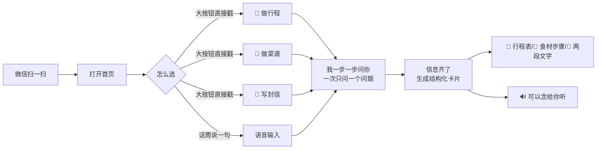
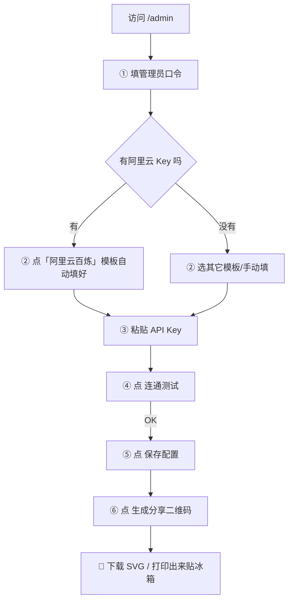

# 兄弟 AI · BroAI

> 给家里人（爸妈 / 爷爷奶奶）用的 AI 小助手。不用注册、不用会打字，微信扫一扫就能直接说话使唤。

  -orange)

---

## ✨ 一句话能做啥

三句话说清这个产品：

1. **微信扫码就用，零学习成本**。打开微信扫一扫 → 进网页 → 点麦克风/直接打字，没有注册、没有验证码、没有教程。
2. **你说不清楚，我帮你问**。不是甩给你一个空聊天框让你写提示词，而是一步步唠，直到信息够了才给结果。
3. **结果是卡片，不是一大坨文字**。做行程就给你「每天去哪、注意啥」的卡片；做菜就给你「食材表 + 步骤」的卡片；写信就给你「可以直接复制发微信的版本」。

内置了三个家里人最常用的场景：

| 🧳 做行程 | 🍲 做菜谱 | 💌 写封信 |
|--------|--------|--------|
| 目的地 / 天数 / 跟谁去 / 预算…… 自动出每日安排 | 冰箱里有啥就能给你菜，食材 + 步骤 + 小贴士 | 给孩子/孙子孙女写两句话，分成「念出来」和「发微信」两个版本 |

---

## 🖥 界面是啥样的（一图看懂）



给你看管理员填 API Key 的那个页：



---

## 🚀 从零到能扫二维码：5 步

> 下面每一步都做过冒烟测试，照着走就能跑起来。电脑上装了 Node.js 18+ 就行。

### 1️⃣ 克隆 + 装依赖

```bash
git clone <你 Fork 后的仓库地址>
cd BroAI

# 后端依赖
cd backend
npm install
cp env.template .env           # 复制配置模板（生产环境记得改 ADMIN_TOKEN！）
cd ..

# 前端依赖
cd frontend
npm install
cp env.template .env.local     # 默认连本地 4000 端口，一般不用改
cd ..
```

### 2️⃣ 填你自己的 API Key（阿里云百炼为例）

1. 先启动后端：
   ```bash
   cd backend
   npm start
   ```
2. 浏览器打开 `http://localhost:4000/admin`
3. 在「① 管理员鉴权」填 `broai-admin-2025`（**生产环境务必改 `backend/.env` 里的 `ADMIN_TOKEN`**）
4. 「② 选模板」点第一个 **阿里云百炼（兼容模式，推荐）**
5. 「③ LLM 接口」里粘贴你阿里云控制台拿到的 **API Key**
6. 点 **连通测试** → 没报错就点 **保存配置**

> 如果你用的是 DeepSeek / 硅基流动 / 自搭的 OpenAI 兼容服务，模板里都有现成条目，填 Key 即可。模型名按自己购买的填。

### 3️⃣ 启动本地前端看看效果

```bash
cd frontend
npm run dev        # 打开 http://localhost:5173
```

首页就能看到三个漂亮大卡片，点一个试试。

### 4️⃣ 打包生产 + 一体部署（推荐，一个服务搞定）

```bash
cd frontend
npm run build      # 产物在 frontend/dist
cd ../backend
NODE_ENV=production PORT=4000 npm start
```

- `NODE_ENV=production` 时，后端会自动把 `../frontend/dist` 当静态文件托管
- 访问 `http://<你的服务器IP>:4000` 就能直接用
- 管理页：`http://<你的服务器IP>:4000/admin`
- 二维码页：`http://<你的服务器IP>:4000/qrcode`

### 5️⃣ 生成二维码 → 发给她 / 打印贴冰箱

访问 `http://<你的域名或IP>:4000/qrcode`

- **💾 下载 SVG**：可以发家庭群，让她长按图片识别二维码（微信支持）
- **🖨 打印出来**：贴冰箱 / 电话机旁边，想聊天就拿手机扫一下

---

## 🏗 技术选型 & 为什么这么做

| 模块 | 用了啥 | 为啥选它 |
|---|---|---|
| 后端 | Node.js + Express | 生态成熟、改起来快，一台小机器就跑 |
| 数据库 | SQLite（单文件 WAL 模式） | 不装 MySQL / Postgres / Supabase，部署就一个文件夹，备份就拷一个文件 |
| 鉴权 | 浏览器设备指纹（device_id） | 老人不懂注册/验证码。能扫码就能用。 |
| LLM | OpenAI 兼容协议（Axios） | 一次写好，阿里云 / DeepSeek / 硅基流动… 都能切 |
| 成本保护 | 全局单日预算 + 单设备日次上限 + 滑动窗口 | 防止误点、恶意刷，一天花多少自己说了算 |
| 前端 | React + Vite + Tailwind | 构建快、体积小、界面好调 |
| 语音 | 浏览器原生 Web Speech API | 不用装额外 SDK，iOS Safari / Android Chrome 都能用 |

### 目录结构

```
BroAI/
├── backend/                 ← 后端服务（Express + SQLite）
│   ├── server.js            ← 入口、路由总装配
│   ├── config/database.js   ← SQLite 建表 + 配置读写
│   ├── models/              ← 用户 / 对话 / 用量 / 反馈
│   ├── middleware/          ← 设备指纹鉴权 / 预算+限流
│   ├── routes/              ← auth / ai / admin / conversations / usage / feedback
│   ├── utils/openai.js      ← LLM 客户端（OpenAI 兼容）+ 成本估算
│   └── env.template         ← 后端环境变量模板
├── frontend/                ← 前端（React + Vite + Tailwind）
│   ├── src/
│   │   ├── App.tsx          ← 主界面：场景选择 + 聊天 + 语音
│   │   ├── pages/AdminSetup.tsx   ← /admin 配置 API Key
│   │   ├── pages/QrCode.tsx       ← /qrcode 生成分享二维码
│   │   └── components/            ← 场景卡片 / 结果卡片（行程·菜谱·写信）
│   └── env.template         ← 前端环境变量模板
└── docs/
    └── db-schema.sql        ← 数据库表结构（仅阅读，代码会自动建表）
```

---

## 💸 成本是怎么算的？花冒了怎么办

给你的 LLM 配置里，有两个单价字段：`输入单价（元/1K tokens）` 和 `输出单价`。

每次模型返回后，按实际用量估算成「分」，然后累加到当天的「单日预算」里。超过预算，今天就不再受理，首页会提示。

除了全局预算，还有**单设备单日调用次数上限**（默认 25 次）和 **1 分钟滑动窗口限流**，三层一起兜着。

- 所有消耗都会写入 SQLite 的 `api_logs` 表。想看明细？直接用任何 SQLite 可视化工具打开 `backend/data/broai.db` 即可。
- 配置在 `/admin` 页面改完立即生效，不用重启服务。

---

## 🔐 安全与隐私

- **API Key 存哪**：存在后端 SQLite 的 `app_config` 表里，不和前端代码一起打包，前端拿不到。
- **管理员页怎么防进**：请求头里要带正确的 `X-Admin-Token`（和后端 `.env` 里的 `ADMIN_TOKEN` 一致）。没有带或带错，一律 403。
- **生产部署前必须做**：
  1. 改 `backend/.env` 的 `ADMIN_TOKEN` 为一串随机长字符串；
  2. 前面套一个 Nginx / Caddy，上 HTTPS（微信扫码只允许 HTTPS 页面调用麦克风）；
  3. 把 `CLIENT_URL` 改成你的域名，防止随便跨域。
- **本地数据**：所有聊天记录 / 设备 ID 都在你自己服务器上，不发到第三方。

---

## 🧪 常见问题（FAQ）

**Q：微信扫完二维码，打开了但是麦克风按钮点了没反应？**
A：微信浏览器对未授权的域名会禁用麦克风。确保你的域名是 **HTTPS**，并且在微信弹出的权限对话框里允许使用麦克风。另外 iOS 微信对某些国产模型的语音识别支持较差，可以改用键盘打字，体验也一样 ok。

**Q：二维码生成出来了，但换个手机扫打不开？**
A：检查三件事：① 服务器公网 IP 是否放行防火墙（通常是 TCP 80 / 443）；② `CLIENT_URL` 改成了正确的域名；③ 你的后端是不是真的绑在 `0.0.0.0` 上（一般默认是，除非你改了 VPS 网络配置）。

**Q：想换模型，还需要重启后端吗？**
A：不用。去 `/admin` 改模型名、单价，点「保存配置」就生效了。

**Q：我妈说「今天 3 元额度用完了」咋回事？**
A：默认每天总预算是 3 元（300 分）。去 `/admin` 把「单日总预算」改大一点，点保存就行，当天立刻生效。

**Q：数据库想备份 / 想搬家？**
A：整个项目最值钱的就是 `backend/data/broai.db` 这一个文件。拷贝它就是完整备份。搬家把这个文件放到新机器的相同目录就行。

---

## 🤝 二次开发建议

- **加场景**：改 `backend/routes/ai.js` 里的场景提示词 + `frontend/src/components/ScenePicker.tsx` + `CardSwitch.tsx` 里加一种新卡片类型。基本用的就是**策略模式**，加一个场景基本不碰其他模块。
- **换 UI 风格**：只改 `frontend/src/styles.css` 和组件里的 Tailwind 类，后端零改动。
- **接微信公众号 / 企业微信 / 飞书**：后端 API 是 HTTP JSON，你在外面包一层机器人适配器即可，复用 `/api/ai/chat` 全家桶。

---

## 📄 开源协议 & 致谢

本项目是 MIT 协议。随便用、随便改、商用也不用打招呼，但 **后果自负**，不承担任何因 API 花费、数据丢失、服务故障导致的责任。

这个项目的初心特别简单——就是为了让自己的妈也能用上 AI。
愿你的家里人，点开这个网页，听到那句「嘿，张阿姨」的时候，也能会心一笑。

❤️ 兄弟 AI，给家里人用的 AI。
